Me interesa el desarrollo de software y la resolución de problemas. Soy de Ecuador. Además doy clases de Física en ICEPOL, una academia de preparación universitaria.

## Tecnologías

## Proyectos

| Proyecto | Qué es | Tecnologías | Estado |
|---|---|---|---|
| **App Android con POO** | Aplicación para celulares que une la lógica en Java, hecha con programación orientada a objetos, con una interfaz gráfica creada en Android Studio. | Java, POO, Android Studio | Terminado |
| **Sitio web de ICEPOL** | Página multipágina para una academia preuniversitaria: cursos, reseñas y formulario de contacto que guarda los mensajes en una base de datos, con validación en el servidor. | HTML, CSS, JavaScript, PHP, MySQL | En desarrollo |
| **Sistema POS** | Sistema de punto de venta con programación orientada a objetos. Los datos se almacenan en una base de datos. | POO, MySQL | En desarrollo |

## GitHub

## Contacto

